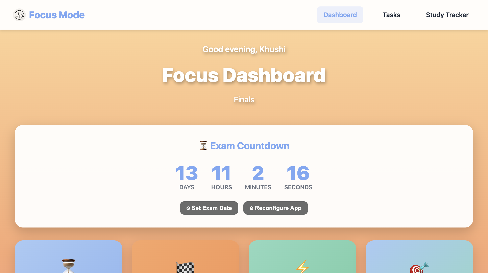

# Focus Mode - By a Student, For Students

Hey there! 👋 I'm a student who got tired of finding PAID website blockers that are genertic and uncustomizable (and might I say not as cute). So I built this.

This is a fully customizable productivity app with personalized motivations, website blocking, Pomodoro timers, and task management. Built for students, academics, and anyone grinding toward a big goal.


## Why I Built This

We all know the struggle: You're supposed to be studying, but somehow you end up on YouTube watching "just one video" that turns into three hours. Generic blockers just frustrate you. But what if instead of seeing "BLOCKED", you saw your own reasons for why you need it in the first place.

That's what this does. When you try to visit a distracting site, you see YOUR motivations - the ones you wrote during setup. Your investment, your goals, your why.

## Why you should try it

This app reminds you WHY you're blocking distractions with YOUR personal motivations. You go through a quick 5-minute setup to customize everything for your unique situation - whether you're prepping for med school boards, the bar exam, finals, or any goal that matters to you.


*Your personalized dashboard with live countdown and quick actions*

## Features

**Smart Website Blocking**
- Redirect distracting sites to a personalized motivation page
- Shows your custom motivations and quotes
- Beautiful, animated redirect page

**Pomodoro Study Tracker**
- Customizable timer presets (5, 15, 25, 50 minutes)
- Visual circular progress indicator
- Session logging with notes
- Daily and total study time tracking

**Task Manager**
- Create, edit, and delete tasks
- Priority levels (High, Medium, Low) with color coding
- Task completion tracking
- Filter by status and priority

**Dashboard**
- Live countdown to your goal/exam
- Study statistics overview
- Quick navigation to all features
- Your personalized motivation cards

## Getting Started

### What You'll Need
- Node.js (v14 or higher) - [Download here](https://nodejs.org/) if you don't have it
- npm (comes bundled with Node.js)

### Setup (Takes ~2 minutes)

```bash
# Clone the repository
git clone https://github.com/khushxxii/blocked-sites-redirect.git
cd blocked-sites-redirect

# Install dependencies
npm install

# Start the server
npm start
```

Open your browser to `http://localhost:3000`

### First-Time Setup (This is the important part!)

When you first open the app, you'll go through a setup wizard. This is where the magic happens - take it seriously:

1. **Basic Information**
   - Your name (optional)
   - Field of study or work
   - Main goal

2. **Personal Motivations** (3-6 motivations)
   - Add motivations that truly resonate with you
   - Include emoji, title, and description
   - Example: "Investment | You're investing $50K/year - make it count"

3. **Motivational Quotes** (minimum 3)
   - Add quotes that fire you up when tempted to procrastinate
   - Make them specific to your situation
   - Example: "Every hour you study is an investment in your $200K career"

4. **Target Date**
   - Set your goal/exam name and deadline
   - Creates urgency with live countdown

## Setting Up Website Blocking!!

This is where it gets real. Redirect those time-wasting sites to your motivation page:

### Step 1: Install the Browser Extension

**Chrome/Edge/Brave:**
- Install [Redirector Extension](https://chromewebstore.google.com/detail/redirector/lioaeidejmlpffbndjhaameocfldlhin?hl=en)

**Firefox:**
- Install [Redirector Extension](https://addons.mozilla.org/firefox/addon/redirector/)

### Step 2: Set Up Your Redirect Rules

Now for each time-wasting site you want to block:

1. Click the Redirector icon → "Edit Redirects" → "Create New Redirect"
2. Fill it out:
   - **Description:** "Block YouTube" (or whatever site)
   - **Include pattern:** `*youtube.com*`
   - **Redirect to:** `http://localhost:3000/blocked?site=youtube`
   - **Pattern type:** Wildcard
3. Toggle it on

Rinse and repeat for your personal demons: Netflix, Instagram, Twitter, Reddit, TikTok, whatever drains your time.

**Pro tip:** Don't block EVERYTHING right away. Start with your top 2-3 time wasters, then add more as needed.

## Need to Update Your Setup?

Your motivations will evolve as you progress. Click the "Reconfigure App" button on the dashboard anytime you need to update your goals, motivations, or target date.

## How to Actually Use This

**When You're About to Study:**
1. Open the Study Tracker
2. Type what you're working on (be specific!)
3. Click a timer preset (I recommend 25 min to start)
4. Put your phone away and focus
5. When the timer ends, log how it went

**Managing Your Tasks:**
1. Go to Tasks
2. Brain dump everything you need to do
3. Set priorities (be honest with yourself)
4. Check them off as you complete them (feels amazing!)

**Watching Your Progress:**
- Dashboard shows how much you're actually working (no lying to yourself)
- Countdown timer keeps the urgency real
- Your motivation cards remind you why you're doing this

## Project Structure

```
blocked-sites-redirect/
├── server.js              # Express backend server
├── package.json           # Dependencies and scripts
├── public/               # Frontend files
│   ├── setup.html        # Personalization wizard
│   ├── blocked.html      # Blocked sites redirect page
│   ├── dashboard.html    # Main dashboard
│   ├── tasks.html        # Task manager
│   ├── tracker.html      # Study session tracker
│   └── style.css         # Global styles
└── README.md             # This file
```

## What's Under the Hood

- **Backend:** Node.js + Express (keeping it simple)
- **Database:** SQLite3 (local, lightweight, no setup needed)
- **Frontend:** Vanilla JavaScript, HTML5, CSS3 (no framework bloat - just the basics that work)

## API Endpoints

If you want to extend this or build something on top of it, here are the endpoints:

**User Setup & Config**
- `GET /api/user-config` - Get personalization settings
- `POST /api/user-config` - Save/update personalization

**Goal & Exam Settings**
- `GET /api/settings` - Get exam/goal settings
- `PUT /api/settings` - Update settings

**Task Management**
- `GET /api/tasks` - Get all tasks
- `POST /api/tasks` - Create new task
- `PUT /api/tasks/:id` - Update a task
- `DELETE /api/tasks/:id` - Delete a task

**Study Sessions**
- `GET /api/study-sessions` - Get all sessions
- `POST /api/study-sessions` - Log a new session

**Statistics**
- `GET /api/stats` - Get overall stats (total study time, etc.)

## How to Write Motivations That Actually Work

Here's the thing: generic motivational quotes don't work when you're 30 seconds away from clicking on YouTube. You need stuff that hits YOU specifically.

**Medical Student**
- "Medical School Investment | $280K in debt - every study hour matters"
- "Future Patients | This knowledge will save lives someday"
- "Step 1 Deadline | Exam in 60 days - no extensions, no excuses"

**Software Engineer**
- "Career Transformation | From $45K to $150K+ - code your way up"
- "Stay Relevant | Tech moves fast - learn or become obsolete"
- "FAANG Goal | Top companies want the best - be undeniable"

**CPA Candidate**
- "Exam Investment | $1,000+ in fees - pass first try"
- "Partnership Track | CPA required for advancement"
- "Score Expiration | 18 months before scores expire"

## Common Issues (Don't Panic!)

**"Port 3000 is already in use"**
Someone's already using that port. Change it in `server.js`:
```javascript
const PORT = 3001; // or any available port
```
Then update your browser extension redirect URLs to match the new port.

**Database Errors?**
Just delete `exam_focus.db` and restart the server. It'll recreate itself automatically - you'll just need to go through setup again.

**Sites Aren't Getting Blocked?**
Check these:
1. Is the server actually running? (`npm start`)
2. Is the browser extension installed AND turned on?
3. Are your redirect rules set up correctly?
4. Are you using the right URL format? `http://localhost:3000/blocked?site=sitename`

**Want to Start Fresh?**
1. Stop the server (Ctrl+C)
2. Delete `exam_focus.db`
3. Restart server
4. Go through setup again with your new mindset

## Who This Is For

This app works best if you're:
- A student with exams coming up (midterms, finals, boards, you name it)
- Preparing for professional certifications (CPA, Bar, NCLEX, etc.)
- Working on a thesis or dissertation
- Learning to code or switching careers
- Anyone with a big goal, a deadline, and way too many distractions

## Want to Contribute?

Found a bug? Have an idea for a feature? Contributions are super welcome! Feel free to submit a Pull Request. For big changes, open an issue first so we can discuss it.

Check out [CONTRIBUTING.md](CONTRIBUTING.md) for guidelines.

## License

MIT License - do whatever you want with this code. See [LICENSE](LICENSE) for details.

## Need Help?

If something's not working or you have questions:
- Open an [issue](https://github.com/khushxxii/blocked-sites-redirect/issues)
- Check the troubleshooting section above
- Or just try turning it off and on again (seriously, that fixes a lot)

## Real Talk: Tips for Actually Making This Work

1. **Be brutally honest with yourself** - Don't write generic motivations. Write what ACTUALLY fires you up or scares you into action.

2. **Be specific** - "Work hard" won't do anything. "You're investing $50K this year - every wasted hour is literally burning money" hits different.

3. **Actually use it daily** - Track every study session. The stats don't lie, and lying to yourself won't help.

4. **Don't skip the blocked page** - When you get redirected, READ your motivations. Don't just close the tab and move on.

5. **Update when needed** - Your motivations will lose power over time. Refresh them when they stop hitting as hard.

6. **Pomodoro is legit** - 25 minutes of deep focus beats 3 hours of "studying" with your phone in hand.

---

## One Last Thing

This isn't just about blocking websites. It's about remembering why you started when you're tempted to quit. We all have days where we'd rather watch Netflix than study - this app just reminds you why you're choosing the hard path.

You've got this. Now go build the future you're working toward. 💪

---

**Made with ☕ and late-night study sessions by a fellow student who gets the struggle.**
